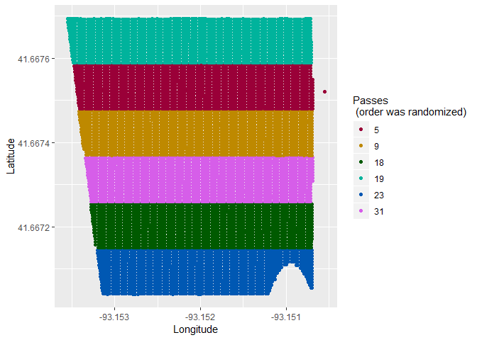
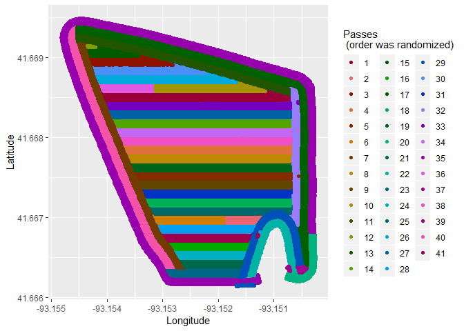

Ag Machine Pass Numbering
================
Eric Coronel
August 6, 2018

Purpose of this script
======================

Data collected by agricultural equipment is not user friendly, especially when within-field data manipulation is needed. It is simple to calculate average yield or fuel usage per field. The challenge is obtaining attributes from individual field passes inside the field when there are no identifiers to perform subsettings or groupings.
The code included here uses time difference in seconds between observations to separate machinery passes. The threshold for separating passes can be modified.

Packages needed
---------------

``` r
library(dplyr)
library(ggplot2)
library(rgdal)
```

Importing the seeding shapefile
-------------------------------

A publicly available seeding shapefile can be found at a [Deere website](https://developer.deere.com/#!documentation&doc=.%2Fmyjohndeere%2FfieldOperations.htm&anchor=). Within the website, search for "Click below to download sample shapefiles" and download the Seeding shapefile. The zip file needs to be decompressed. The `pointDropZ = TRUE` parameter is needed because the shapefile has an empty Z column; likely an error during the creation of the file.
I created a working copy to avoid manipulating the original file since it takes about 30 seconds to import the original shapefile.

``` r
# Importing the shapefile
seeding_shapefile <- readOGR(dsn = "C:/Users/EricCoronel/Documents/various_DS_projects/Ag_Machine_Pass_Numbering/primitives/seeding_shapefile", layer = "Merriweather Farms-JT-01-Corn", pointDropZ = TRUE)
```

    ## OGR data source with driver: ESRI Shapefile 
    ## Source: "C:\Users\EricCoronel\Documents\various_DS_projects\Ag_Machine_Pass_Numbering\primitives\seeding_shapefile", layer: "Merriweather Farms-JT-01-Corn"
    ## with 63761 features
    ## It has 10 fields

``` r
# Working copy
work_copy <- seeding_shapefile
```

First processing
----------------

This chunk does the following:

-   Creates a datetime variable.
-   Calculates time difference in seconds among consecutive records.
-   Creates an indicator variable that assigns 0 if time difference is between 0 to 6 seconds, and 1 to all others.
-   Calculates the cumulative sum of the indicator variable.

Since data are arranged in ascending time order, the cumulative sum of the indicator variable gives us the total number of passes.

``` r
work_copy@data <- work_copy@data %>%
  mutate(datetime = as.POSIXct(Time, format = "%m/%d/%Y %H:%M:%S"),
         diff1 = c(NA, diff(datetime)),
         indicator = ifelse(diff1 %in% c(0:6), 0, 1),
         pass_num = cumsum(indicator))
```

Calculating observations per pass
---------------------------------

Another useful attribute for grouping or subsetting is knowing the number of observations per pass. This code also creates a random order of pass numbers (`pass_scramble`) which is useful for later visualization.

We first create a new file, `obs_pass`, with the variables mentioned above.

``` r
obs_pass <- work_copy@data %>%
  group_by(pass_num) %>%
  summarize(obs_per_pass = n()) %>%
  mutate(pass_scramble = factor(sample(pass_num)))
```

Joining new data to seeding shapefile
-------------------------------------

This chunk:

-   Joins the `obs_pass` file to the seeding shapefile.
-   Removes `datetime`, `diff1`, and `indicator` variables.
-   Makes actual pass numbers variable, `pass_num`, a factor.

``` r
work_copy@data <- work_copy@data %>%
  left_join(obs_pass, by = "pass_num") %>%
  select(-datetime, -diff1, -indicator) %>%
  mutate(pass_factor = factor(pass_num))
```

Giving the coordinates for each point
-------------------------------------

It is often useful to have the coordinates as part of the attribute table.

``` r
# Creating file with coordinates
xycoords <- work_copy %>%
  coordinates() %>%
  data.frame

# Joining the coordinates with the shapefile
work_copy@data <- work_copy@data %>%
  bind_cols(xycoords)
```

Ploting final version
---------------------

The variable `pass_scramble` is used for coloring to help with visualization.

``` r
# Using a subset for faster display
ggplot(filter(work_copy@data, pass_num %in% 20:25), 
       aes(x = coords.x1, y = coords.x2, color = pass_scramble)) +
  geom_point() +
  scale_color_hue(h = c(0, 360), c = 100, l = c(30, 60)) +
  labs(x = "Longitude",
       y = "Latitude",
       color = "Passes \n (order was randomized)")
```



``` r
# Plotting the entire shapefile
ggplot(work_copy@data, aes(x = coords.x1, y = coords.x2, color = pass_scramble)) +
  geom_point() +
  scale_color_hue(h = c(0, 360), c = 100, l = c(30, 60)) +
  labs(x = "Longitude",
       y = "Latitude",
       color = "Passes \n (order was randomized)")
```


